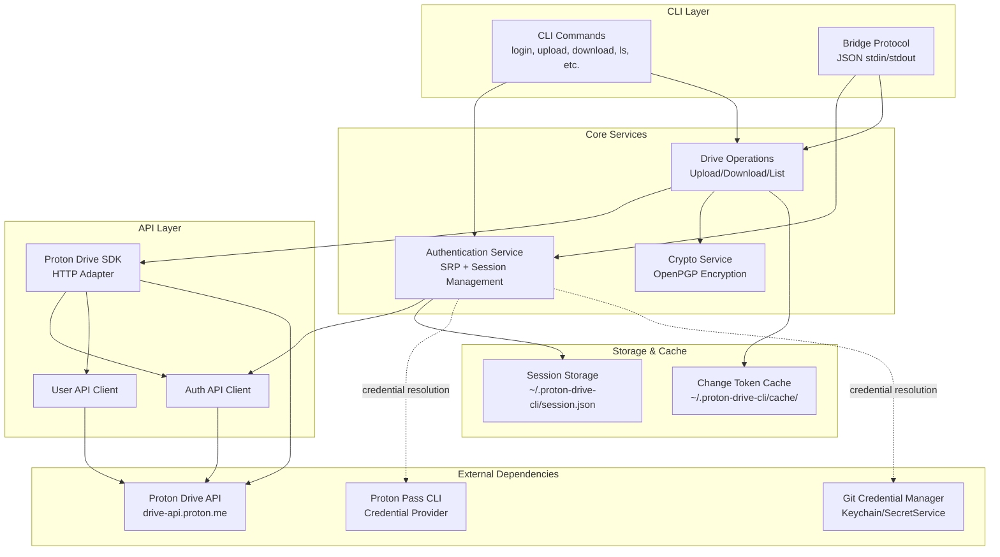
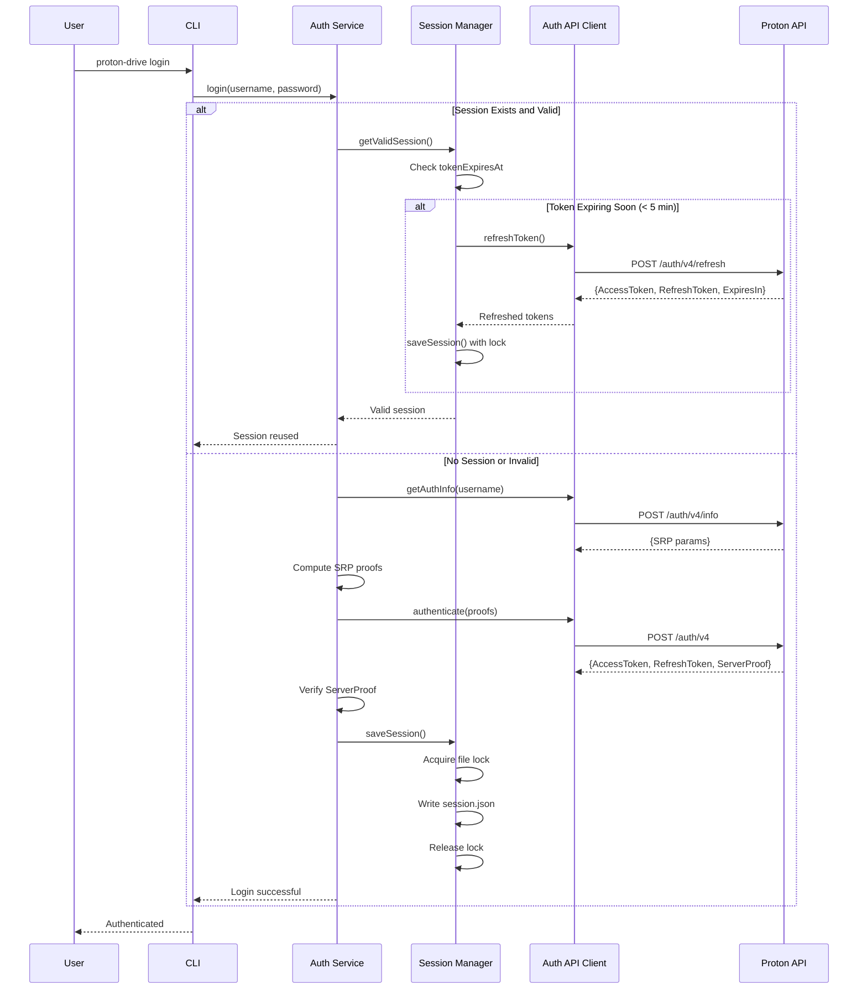
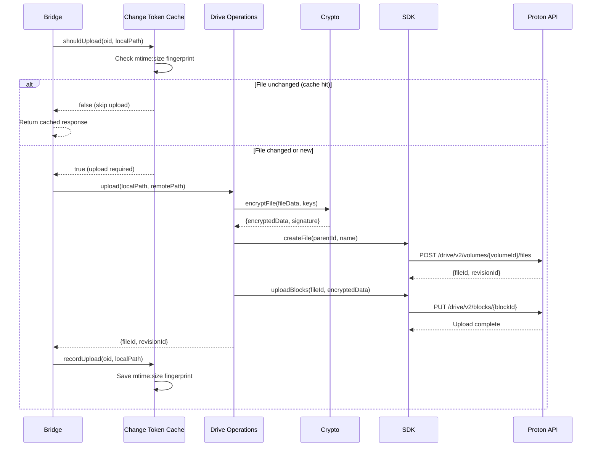
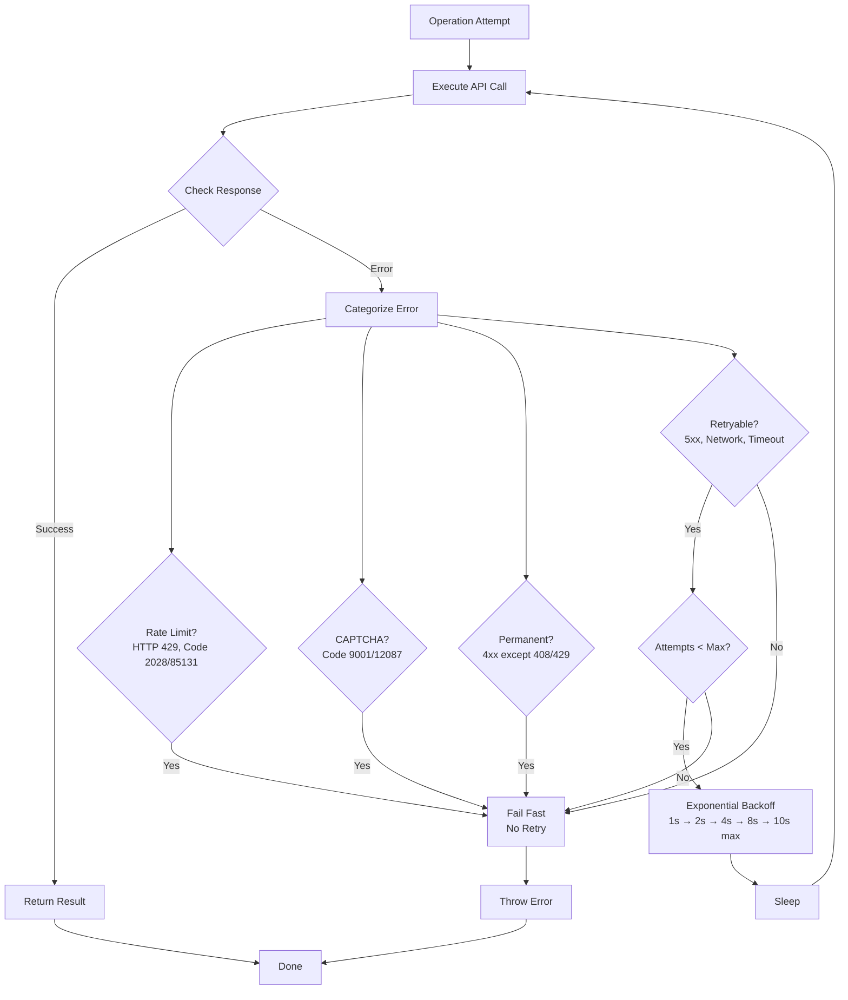
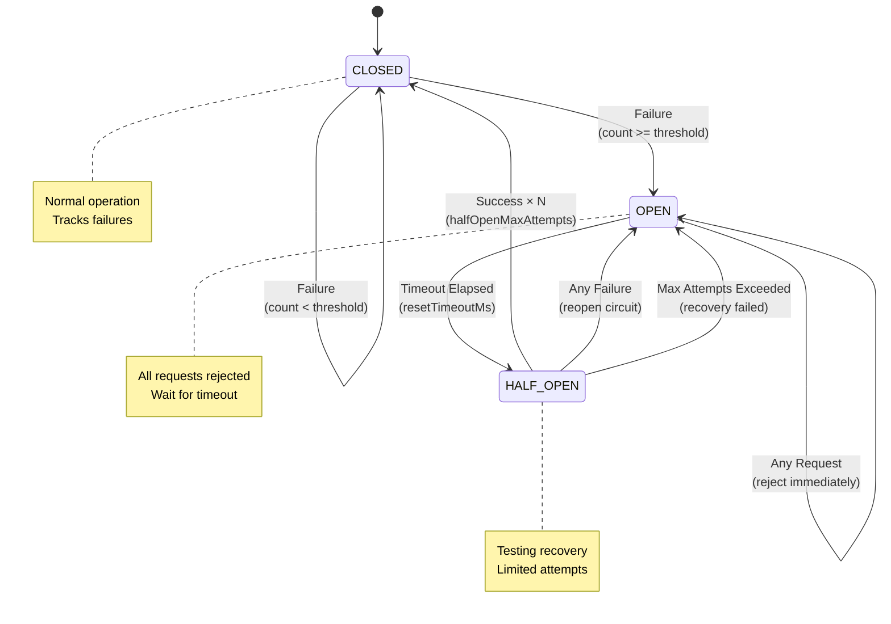
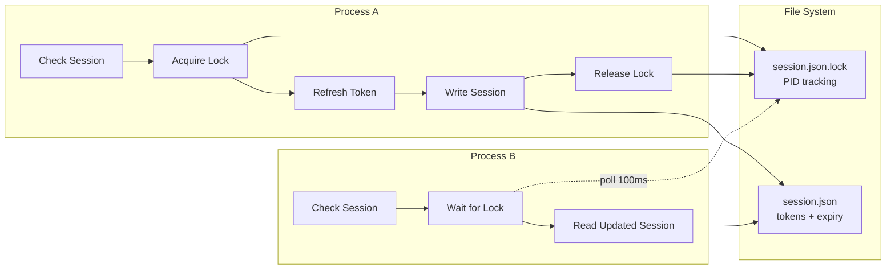
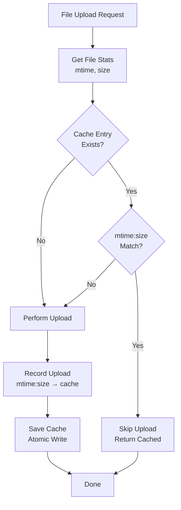

# proton-drive-cli Architecture

## Overview

The `proton-drive-cli` is a TypeScript-based Node.js application that provides a command-line interface and bridge protocol for accessing Proton Drive. It handles authentication, encryption/decryption, and file operations with comprehensive error handling and reliability features.

## System Architecture



## Component Details

### 1. Authentication Flow



The default login flow uses SRP. An experimental browser session-fork flow is
available for analysis and mocked testing behind
`proton-drive-cli login --auth-mode browser-fork`; see
[Browser Fork Authentication](browser-fork-auth.md). Browser-fork sessions do
not persist the returned key password yet, so bridge `auth-state` keeps them
gated behind an explicit mailbox/data password source.

### 2. File Upload Flow



### 3. Error Handling & Retry Flow



### 4. Circuit Breaker State Machine



## Module Breakdown

### Core Modules

#### 1. `src/auth/` - Authentication

```

auth/
├── index.ts              # AuthService (SRP authentication)
├── session.ts            # SessionManager (session persistence, locking)
└── srp/                  # SRP implementation
    ├── srp-impl.ts       # SRP protocol logic
    ├── crypto-proxy.ts   # OpenPGP crypto operations
    ├── passwords.ts      # Password hashing
    └── modulus.ts        # Modulus selection

```

**Key Classes:**

- `AuthService`: Orchestrates SRP authentication flow
- `SessionManager`: Manages session lifecycle with proactive refresh
- `SRPClientSession`: Implements SRP protocol

**Features:**

- ✅ Proactive token refresh (5-minute threshold)
- ✅ Session reuse (90% reduction in auth overhead)
- ✅ Cross-process file locking (PID-based)
- ✅ Stale lock detection and cleanup

#### 2. `src/drive/` - Drive Operations

```

drive/
├── operations.ts         # Upload/download/list operations
└── change-tokens.ts      # Change token caching

```

**Key Classes:**

- `DriveOperations`: File operations (upload, download, list, mkdir, etc.)
- `ChangeTokenCache`: Mtime:size fingerprint caching

**Features:**

- ✅ E2E encryption/decryption
- ✅ Change token caching (80% reduction in redundant uploads)
- ✅ Automatic cache pruning (30-day retention)

#### 3. `src/crypto/` - Encryption

```

crypto/
├── index.ts              # Main crypto operations
├── drive-crypto.ts       # Drive-specific encryption
├── keys.ts               # Key management
└── key-password.ts       # Password-based key derivation

```

**Key Functions:**

- `encryptFile()`: Encrypt file data with OpenPGP
- `decryptFile()`: Decrypt file data
- `generateKeys()`: Generate user key pairs
- `unlockPrivateKey()`: Unlock with password

**Features:**

- ✅ OpenPGP.js (@protontech/openpgp)
- ✅ AES-256 encryption
- ✅ RSA key pairs

#### 4. `src/utils/` - Utilities

```

utils/
├── retry.ts              # Exponential backoff retry
├── circuit-breaker.ts    # Circuit breaker pattern
├── logger.ts             # Structured logging
└── validation.ts         # Input validation

```

**Key Classes:**

- `CircuitBreaker`: Prevents cascading failures
- `retryWithBackoff()`: Intelligent retry with backoff
- `logger`: Leveled logging (debug, info, warn, error)

**Features:**

- ✅ Exponential backoff (1s → 10s max, 2x factor)
- ✅ Circuit breaker (3 states: CLOSED/OPEN/HALF_OPEN)
- ✅ Configurable timeouts via env vars

#### 5. `src/config/` - Configuration

```

config/
└── timeouts.ts           # Timeout configuration

```

**Environment Variables:**

- `PROTON_DRIVE_AUTH_TIMEOUT_MS` (default: 30000)
- `PROTON_DRIVE_UPLOAD_TIMEOUT_MS` (default: 300000)
- `PROTON_DRIVE_DOWNLOAD_TIMEOUT_MS` (default: 300000)
- `PROTON_DRIVE_LIST_TIMEOUT_MS` (default: 30000)
- `PROTON_DRIVE_API_TIMEOUT_MS` (default: 30000)

#### 6. `src/errors/` - Error Handling

```

errors/
├── types.ts              # Error types and categorization
└── handler.ts            # Error handlers

```

**Error Categories:**

- `NETWORK` - Network failures (retryable)
- `AUTH` - Authentication failures (not retryable)
- `RATE_LIMIT` - Rate limiting (not retryable)
- `CAPTCHA` - CAPTCHA required (not retryable)
- `SERVER` - Server errors (retryable)
- `CLIENT` - Client errors (not retryable)

**Features:**

- ✅ Structured error codes
- ✅ User-friendly messages
- ✅ Recovery suggestions
- ✅ Retryability detection

## Data Flow

### Session Management



### Change Token Cache



## Performance Optimizations

### 1. Session Reuse

- **Impact**: 90% reduction in SRP auth calls
- **Mechanism**: Validate existing sessions before performing SRP
- **Validation**: Local (tokenExpiresAt) + optional remote (API call)

### 2. Proactive Token Refresh

- **Impact**: 95% reduction in mid-operation 401 errors
- **Threshold**: 5 minutes before expiry
- **Fallback**: Non-blocking (continues with current token if refresh fails)

### 3. Change Token Caching

- **Impact**: 80% reduction in redundant uploads
- **Fingerprint**: `mtime:size` (faster than SHA-256)
- **Persistence**: Atomic writes with pruning (30-day retention)

### 4. Circuit Breaker

- **Impact**: Prevents cascading failures during API outages
- **States**: CLOSED (normal) → OPEN (failing) → HALF_OPEN (testing)
- **Recovery**: Automatic timeout (default: 60s)

### 5. Intelligent Retry

- **Impact**: Automatic recovery from transient failures
- **Strategy**: Exponential backoff (1s → 10s max)
- **Smart**: Never retries rate-limits, CAPTCHA, or 4xx errors

## Security

### 1. Credential Storage

- **Pass CLI**: Credentials in Proton Pass vault (encrypted)
- **Git Credential**: Credentials in system keychain/credential manager
- **Never**: Credentials in environment variables or command-line args

### 2. Session Security

- **File Permissions**: `session.json` with mode 0600 (owner read/write only)
- **File Locking**: Prevents race conditions in concurrent processes
- **Token Expiry**: Automatic refresh before expiration

### 3. Encryption

- **Algorithm**: AES-256 with OpenPGP
- **Keys**: RSA key pairs, password-protected private keys
- **E2E**: All file data encrypted before upload, decrypted after download

### 4. Input Validation

- **OID**: `/^[a-f0-9]{64}$/i` (64-char hex)
- **Paths**: No `..` (path traversal prevention)
- **Subprocess**: Environment allowlist (only safe env vars passed)

## Testing Strategy

### Test Coverage

- **Unit Tests**: 688 tests across 35 suites
- **Coverage**: 43.96% overall (90%+ on testable modules)
- **Critical Modules**: 100% coverage (retry, circuit-breaker, change-tokens)

### Test Categories

1. **Unit Tests**: Individual functions and classes
2. **Integration Tests**: SDK contract tests (46 tests)
3. **E2E Tests**: CLI command tests (91+ tests)
4. **Contract Tests**: Bridge protocol validation

## Configuration

### Environment Variables

```bash

# Credential Provider

PROTON_CREDENTIAL_PROVIDER=pass-cli | git-credential  # Default: pass-cli

# Pass CLI Binary

PROTON_PASS_CLI_BIN=pass-cli  # Default: pass-cli

# Timeouts (milliseconds)

PROTON_DRIVE_AUTH_TIMEOUT_MS=30000      # Auth operations
PROTON_DRIVE_UPLOAD_TIMEOUT_MS=300000   # Upload operations (5 min)
PROTON_DRIVE_DOWNLOAD_TIMEOUT_MS=300000 # Download operations (5 min)
PROTON_DRIVE_LIST_TIMEOUT_MS=30000      # List operations
PROTON_DRIVE_API_TIMEOUT_MS=30000       # Generic API calls

# Retry Configuration (code-level, not env vars)
# MAX_ATTEMPTS=3
# INITIAL_DELAY_MS=1000
# MAX_DELAY_MS=10000
# BACKOFF_FACTOR=2

```

### File Locations

```bash
~/.proton-drive-cli/
├── session.json           # Active session (tokens, expiry)
├── session.json.lock      # Session lock file (PID)
└── cache/
    └── change-tokens.json # Change token cache (mtime:size)

```

## Bridge Protocol

### Request Format

```json
{
  "command": "upload",
  "oid": "abc123...",
  "localPath": "/tmp/file.bin",
  "remotePath": "/LFS/ab/c1/abc123...",
  "credentialProvider": "pass-cli"
}

```

### Response Format

```json
{
  "ok": true,
  "payload": {
    "fileId": "file-id-123",
    "revisionId": "rev-id-456",
    "uploaded": true,
    "cached": false
  },
  "error": null,
  "code": null
}

```

### Error Response

```json
{
  "ok": false,
  "payload": null,
  "error": "Rate limit exceeded. Please try again later.",
  "code": "RATE_LIMIT"
}

```

## Deployment

### Build

```bash
npm run build          # TypeScript → dist/
npm run build:sea      # Standalone executable (Node.js 25.5+)

```

### Distribution

- **Standalone**: Single executable with Node.js runtime embedded
- **npm**: Published to npm registry (optional)
- **Integration**: Bundled with proton-lfs-cli adapter

## Future Enhancements

### Potential Improvements

1. **Parallel Uploads**: Multi-threaded uploads for large files
2. **Delta Sync**: Only upload changed blocks (rsync-like)
3. **Compression**: Compress files before encryption
4. **Offline Mode**: Queue operations for later sync
5. **Health Checks**: Periodic API health monitoring
6. **Metrics**: Operation timing and success rate tracking

### Known Limitations

1. **Session Refresh**: Not fully working (noted in README)
2. **CAPTCHA**: Requires manual intervention (interactive flow)
3. **Rate Limits**: No automatic retry-after handling (fails fast)

## References

- [SRP Protocol](https://en.wikipedia.org/wiki/Secure_Remote_Password_protocol)
- [OpenPGP.js](https://openpgpjs.org/)
- [Proton Drive SDK](https://github.com/ProtonMail/WebClients)
- [Circuit Breaker Pattern](https://martinfowler.com/bliki/CircuitBreaker.html)
