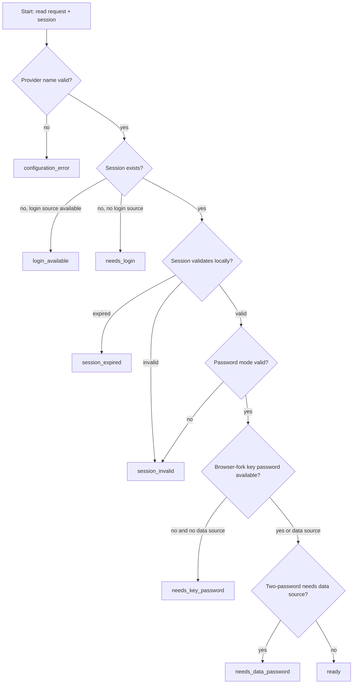

# proton-drive-cli Feature Audit

Last audited: 2026-06-22

This document is the formal feature inventory for `proton-drive-cli`. Runtime
behavior and tests remain authoritative; this file records the intended public
surface, current maturity, coverage, and known gaps.

## Status Legend

| Status | Meaning |
| --- | --- |
| Stable | Implemented, deterministic, and covered by unit or mocked integration tests. |
| Beta | Implemented and covered, but still needs broader real Proton canary coverage before being called fully production-solid. |
| Experimental | Implemented behind explicit user action or guarded flow; expected to change as Proton SDK/auth behavior changes. |
| Guarded | Available only through explicit opt-in or offline preflight because accidental real auth could be risky. |
| Gap | Missing, incomplete, or intentionally not implemented. |

## Public CLI Surface

| Command | Purpose | Main inputs | Status | Primary coverage |
| --- | --- | --- | --- | --- |
| `login` | SRP login with interactive, stdin, or provider-backed credentials. | `--username`, `--password-stdin`, `--credential-provider`, `--auth-mode srp`. | Beta | `src/cli/login.test.ts`, `src/auth/index.test.ts`, `src/auth/flow-safety.test.ts`, `src/api/auth.test.ts`, `src/cli/e2e.test.ts`. |
| `login --auth-mode browser-fork` | Browser session-fork login that stores only session tokens plus a UID-scoped derived user key password in a credential provider. | Browser sign-in URL, fork selector, credential provider defaults. | Experimental | `src/auth/browser-fork.test.ts`, `src/cli/login.test.ts`, `src/cli/bridge.test.ts`. |
| `logout` | Revoke session best-effort, clear local session and crypto cache, remove browser-fork key password when present. | Current session. | Beta | `src/auth/index.test.ts`, `src/cli/login.test.ts`, `src/cli/e2e.test.ts`. |
| `status` | Show auth/session status, password mode, auth mode, and browser-fork key-password availability. | Current session file and key-password store. | Beta | `src/cli/login.test.ts`, `src/auth/session.test.ts`. |
| `session refresh` | Headless refresh-token flow used by tray heartbeat. No full login attempt. | Existing session refresh token. | Beta | `src/auth/session.test.ts`, `src/auth/index.test.ts`, `src/cli/login.test.ts`. |
| `credential store` | Store login credentials in `git-credential` or `pass-cli`. | `--username`, `--password-stdin`, `--host`, `--provider`. | Stable for provider contract; OS helper behavior is environment-dependent. | `src/cli/credential.test.ts`, `src/credentials/*.test.ts`. |
| `credential remove` | Remove stored login credentials. | `--username`, `--host`, `--provider`. | Stable for provider contract; pass-cli delete depends on item metadata. | `src/cli/credential.test.ts`, `src/credentials/pass-cli.test.ts`, `src/credentials/git-credential.test.ts`. |
| `credential verify` | Verify a stored credential can be resolved without printing the secret. | `--host`, `--provider`. | Stable | `src/cli/credential.test.ts`, `src/credentials/*.test.ts`. |
| `doctor` | Offline auth/session preflight. Does not login, refresh, or contact Proton. | Credential provider/host, optional data provider/host, session file, strict/json options. | Stable for offline checks. | `src/cli/doctor.test.ts`. |
| `ls` | List Drive folder contents. | Path, credential provider, key unlock password source. | Beta | CLI validation in `src/cli/e2e.test.ts`; SDK/path behavior in `src/sdk/*.test.ts`. |
| `upload` | Upload a local file or stdin to Drive. | File path or `-`, destination path, optional `--name`. | Beta | CLI validation in `src/cli/e2e.test.ts`; SDK behavior mocked/contract-tested. |
| `download` | Download Drive file to local filesystem. | Source path, output path, optional `--skip-verification`. | Beta | CLI validation in `src/cli/e2e.test.ts`; SDK behavior mocked/contract-tested. |
| `mkdir` | Create a Drive folder. | Parent path, folder name. | Beta | CLI validation in `src/cli/e2e.test.ts`; SDK path resolver tests. |
| `rm` | Trash or permanently delete a Drive node. | Path, optional `--permanent`. | Beta | CLI validation in `src/cli/e2e.test.ts`; bridge helper tests. |
| `mv` | Move or rename a Drive node. | Source path, destination path. | Beta | CLI validation in `src/cli/e2e.test.ts`; bridge helper tests. |
| `cat` | Stream Drive file contents to stdout. | File path. | Beta | CLI validation in `src/cli/e2e.test.ts`; SDK/download behavior mocked. |
| `info` | Print Drive node metadata. | File or folder path. | Beta | CLI validation in `src/cli/e2e.test.ts`; SDK metadata behavior mocked. |
| Global flags | Debug, verbose, quiet, version, help. | `--debug`, `--verbose`, `--quiet`, `--version`, `--help`. | Stable | `src/cli/e2e.test.ts`. |

## Bridge Protocol Surface

The bridge reads one JSON object from stdin and writes one strict JSON envelope
to stdout. It is used by `proton-lfs-cli` and must keep stdout machine-readable.

### Request Fields

Runtime validation uses the canonical per-command matrix in
`schemas/bridge/v1/request-field-rules.json`. Unknown fields, fields that
belong to another bridge command, wrong primitive types, and missing required
command fields return a `400` envelope before credential resolution, SDK
initialization, or local file operations.

| Field | Meaning | Secret? | Notes |
| --- | --- | --- | --- |
| `username` | Login username or credential lookup hint. | No | May be omitted for session-only operations. |
| `password` | Login password for SRP. | Yes | Only accepted through stdin JSON from a trusted parent process; never CLI args. |
| `dataPassword` | Mailbox/data password for key unlock. | Yes | Separate from login password; prevents accidental two-password misuse. |
| `credentialProvider` | Login credential provider selector. | No | `git-credential` or `pass-cli`; bridge resolves locally. |
| `dataCredentialProvider` | Mailbox/data credential provider selector. | No | Uses distinct default host. |
| `dataCredentialHost` | Host/key for mailbox/data credential. | No | Defaults to `proton-data.proton-lfs-cli.local`. |
| `secondFactorCode` | TOTP/FIDO2 flow input where supported. | Yes | TOTP is supported; FIDO2 remains interactive/browser-oriented. |
| `appVersion` | Proton API app-version override. | No | Propagated into SDK/client adapters. |
| `oid` | Git LFS object ID. | No | Must be 64 hex characters. |
| `path` | Local upload path. | No | Null bytes and `..` segments are rejected. |
| `outputPath` | Local download path. | No | Null bytes and `..` segments are rejected. |
| `folder` | Drive folder path for list. | No | Defaults to storage base where relevant. |
| `storageBase` | Root Drive folder for LFS objects. | No | Defaults to `LFS`. |
| `allowLogin` | Whether SDK init may perform full SRP login. | No | Root adapter sends `false` for transfer commands. |
| `oids` | Batch OID list. | No | Used by `batch-exists` and `batch-delete`. |

### Commands

| Bridge command | Purpose | Network/auth behavior | Status | Primary coverage |
| --- | --- | --- | --- | --- |
| `auth` | Full SRP login or provider-backed login. | May contact Proton and create session. | Beta | `src/cli/bridge.test.ts`, `src/cli/e2e.test.ts`, auth tests. |
| `auth-state` | Offline readiness inspection. | Must not resolve credentials, refresh, or contact Proton. | Stable | `src/cli/bridge.test.ts`. |
| `init` | Ensure storage base folder exists. | Uses existing session/unlock material; `allowLogin=false` from root. | Beta | Root mocked E2E and `src/cli/bridge.test.ts`. |
| `upload` | Store object at `/LFS/aa/bb/<oid>`. | Existing session only in adapter path. | Beta | Retries transient SDK failures and skips already-present remote OIDs. |
| `download` | Retrieve object by OID to local output path. | Existing session only in adapter path. | Beta | Retries transient SDK failures and removes partial output before retry. |
| `list` | List folder contents. | Existing session or explicit CLI auth path. | Beta | Bridge tests and SDK behavioral tests. |
| `exists` | Return OID existence. | Existing session only in adapter path. | Beta | Root adapter tests and mocked E2E. |
| `delete` | Delete OID object. | Existing session only in adapter path. | Beta | Bridge helper tests. |
| `refresh` | Refresh access token from saved session. | Refresh endpoint only; no SRP login. | Beta | Session/auth tests. |
| `batch-exists` | Check multiple OIDs. | Existing session only. | Beta | Bridge tests. |
| `batch-delete` | Delete multiple OIDs. | Existing session only. | Beta | Bridge tests. |

### Response Envelope

Success:

```json
{"ok": true, "payload": {}}
```

Failure:

```json
{"ok": false, "error": "message", "code": 401, "details": "{\"errorCode\":\"...\"}"}
```

Bridge callers should use `code` and `details.errorCode` when present. Important
auth/configuration errors are:

| Error code | HTTP-style code | Meaning |
| --- | --- | --- |
| `AUTH_FAILED` | 401 | Login or key unlock failed. |
| `TWO_FACTOR_REQUIRED` | 401 | TOTP/FIDO2 challenge required. |
| `DATA_PASSWORD_REQUIRED` | 401 | Two-password account needs mailbox/data password. |
| `KEY_PASSWORD_REQUIRED` | 401 | Browser-fork session is missing stored derived key password. |
| `CAPTCHA_REQUIRED` | 407 | Human verification required; use interactive login. |
| `RATE_LIMITED` | 429 | Proton rate limit or cooldown. |

## Auth State Machine

`bridge auth-state` is the safe gate before Git LFS transfers. It is local-only.



Transfer callers must proceed only on `ready`.

## Credential and Secret Storage Contract

| Secret | Storage | Keying | Notes |
| --- | --- | --- | --- |
| Login password | Never in session file. Provider-backed or interactive/stdin only. | Username/email + `proton.me`. | Used for SRP login. |
| Mailbox/data password | Never in session file. Provider-backed or explicit stdin JSON. | Username + `proton-data.proton-lfs-cli.local` by default. | Required for two-password accounts. |
| Browser-fork derived user key password | Provider-backed only. | Proton UID + `proton-drive-key.proton-lfs-cli.local`. | Stored after readback verification; removed on logout/session write rollback. |
| Access/refresh tokens | `~/.proton-drive-cli/session.json` mode `0600`. | Session UID. | Revocable tokens only. |
| Crypto cache | `~/.proton-drive-cli/crypto-cache.json`. | Session UID. | API key metadata, not raw passwords. |

## Test Coverage Matrix

| Feature area | Unit/contract tests | E2E/mocked tests | Coverage status |
| --- | --- | --- | --- |
| CLI registration/help/output modes | `src/cli/e2e.test.ts` | Subprocess CLI execution in Jest. | Stable. |
| SRP auth and safety | `src/auth/index.test.ts`, `src/auth/flow-safety.test.ts`, `src/auth/srp/*.test.ts`, `src/api/auth.test.ts` | No real Proton login by default. | Beta; needs opt-in live canary. |
| Browser-fork auth | `src/auth/browser-fork.test.ts`, `src/cli/login.test.ts` | No real browser login in CI. | Experimental; needs disposable-account canary. |
| Key-password store | `src/auth/key-password-store.test.ts`, credential provider tests. | Root mocked E2E checks missing-secret gating. | Stable for local contract. |
| Credential providers | `src/credentials/*.test.ts`, `src/cli/credential.test.ts`. | Mocked pass-cli in root integration. | Stable for provider contract; OS helper UX remains platform-dependent. |
| Bridge validation/envelope/errors | `src/cli/bridge.test.ts`, `src/bridge/index.test.ts`, `src/bridge/protocol.test.ts`, `src/cli/e2e.test.ts`. | Root `tests/testdata/mock-proton-drive-cli.js`. | Stable. |
| SDK adapter shape | `src/sdk/sdk-contract.test.ts`, `src/sdk/sdk-behavioral.test.ts`, `src/sdk/client.test.ts`. | Root mocked E2E and opt-in SDK integration. | Beta. |
| Path resolution and folder creation | `src/sdk/pathResolver.ts` via SDK behavior tests. | Mocked bridge/root tests. | Beta. |
| Drive file commands | CLI E2E validation and SDK mocks. | No default real Proton Drive command canary. | Beta. |
| Change-token upload cache | `src/drive/change-tokens.test.ts`. | Bridge upload path uses cache. | Stable for local cache behavior. |
| Retry/circuit breaker/timeouts | `src/utils/retry.test.ts`, `src/utils/circuit-breaker.test.ts`, `src/config/timeouts.test.ts`. | No chaos test against real Proton. | Stable locally. |

## Known Gaps and Required Follow-ups

| Gap | Risk | Required action |
| --- | --- | --- |
| No default real Proton login/file canary. | Mocked tests can miss API or policy changes. | Keep real tests opt-in; run only with disposable account after offline gates pass. |
| Browser-fork auth is new and tied to Proton session-fork behavior. | Proton can change payload or fork status semantics. | Keep as Experimental until disposable-account browser canary passes repeatedly. |
| FIDO2 support is not headless. | Accounts requiring hardware keys cannot complete SRP CLI login. | Document browser-fork as preferred path for FIDO2 accounts; do not attempt unsafe automation. |
| Large-file streaming and >2GB behavior are not proven in CI. | Timeouts or memory issues may appear on large Git LFS objects. | Add large-object mocked stress test and opt-in real canary with benign payload. |
| OS credential helper behavior varies by platform. | `git-credential` prompting or storage semantics may differ. | Add platform manual checklist and keep provider operations non-interactive where needed. |
| `pass-cli` item schema may vary by release. | Update/delete can fail if metadata shape changes. | Keep metadata-shape tests and run against current Proton Pass CLI before release. |
| Some generated TypeDoc pages are stale relative to recent auth additions. | API docs may omit new key-password types. | Regenerate TypeDoc in a separate docs-generation change if publishing API docs. |

## Audit Findings Fixed in This Pass

- `KEY_PASSWORD_REQUIRED` was added as a first-class application error in the
  previous auth hardening work, but bridge HTTP status mapping still defaulted
  unknown app errors to `500`. This pass maps it to `401` and adds a unit test.
- Bridge request validation now has a checked-in per-command field contract and
  rejects unknown or command-inappropriate fields before any auth, SDK, or file
  side effects can begin.
